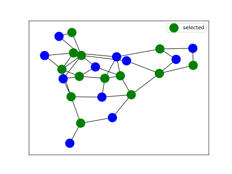

# Vertex Covering Approximation Algorithms

This project contains four implementations of algorithms for computing vertex coverings — the exact algorithm that generates node subsets of incrementing sizes and three different approximation algorithms.

## The Exact Algorithm

The exact algorithm implementation generates all node subsets of incrementing sizes and simply picks the first one that is a valid graph covering. The following is a pseudocode description of this algorithm.

```
G - graph with num_nodes nodes

proc EXACT(G)
    for subset_size in 1..num_nodes
        for node_subset in combinations(nodes, subset_size)
            if is_covering(subset, G)
                return subset
            endif
        endfor
    endfor
endproc
```

Running our implementation on the first small sample dataset and visualizing the results:
```
python3 vertex-covering-approximations exact --dataset vertex-covering-approximations/sample-data/small_01.graph --visualize --plot-path .
```

The visualizations can be used to check the results on smaller graphs:




## The Naive Approximation Algorithm

The naive approximation algorithm iterates over the edges and on encountering an uncovered edge adds the first node of the edge to the covering set.

```
G - graph with num_nodes nodes

proc NAIVE_APPROX(G)
    C := empty_set()
    for (u, v) in edges(G)
        if u not in C and v not in C
            C := union(C, u)
        endif
    endfor
    return C
endproc
```

Running our implementation on the first large sample dataset and visualizing the results:
```
python3 vertex-covering-approximations naive_aprox --dataset vertex-covering-approximations/sample-data/large_01.graph
```

## The Greedy logn-Approximation algorithm

The greedy (logn) approximation algorithm selects nodes with the maximum number of adjacent uncovered edges and adds them to the covering set until all edges are covered.

```
G - graph with num_nodes nodes

proc GREEDY_APPROX(G)
    C := empty_set()
    while exist_uncovered_edges(G)
        u := node_max_uncovered(G)
        C := union(C, u)
    endwhile
    return C
endproc
```
Running our implementation on the first large sample dataset and visualizing the results:
```
python3 vertex-covering-approximations greedy_logn_approx --dataset vertex-covering-approximations/sample-data/large_01.graph
```

## The Greedy 2-Approximation algorithm

The naive approximation algorithm iterates over the edges and on encountering an uncovered edge adds both nodes of the edge to the covering set.

Running our implementation on the first large sample dataset and visualizing the results:
```
python3 vertex-covering-approximations greedy_2_approx --dataset vertex-covering-approximations/sample-data/large_01.graph
```
